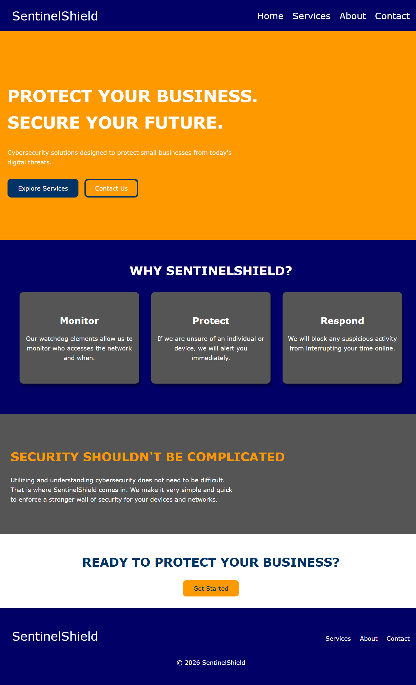
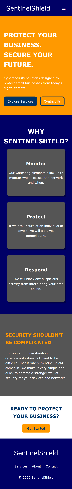

# SentinelShield

## About the Project

SentinelShield was created as a learning and portfolio project for front-end web development. It is meant to showcase a fictional company that specializes in cybersecurity services like data protection, threat protection, network monitoring, and more.

## Screenshots

### Desktop

### MObile

## Features

- Responsive design
- Mobile navigation
- Contact form
- Form validation
- Accessibility features

## Technologies Used

- HTML5
- CSS3
- JavaScript
- Git/GitHub

## What I Learned

I learned how to incorporate a variety of accessibility features like proper form labeling of input fields and buttons, keyboard navigation, visible indicators of focus, and skip-to-content links. I also learned about how to properly use semantic HTML, CSS layouts, page-specific JavaScript, and Git commits. Furthermore, I learned about mobile development with regards to media queries and transitioning to mobile navigation.

## Project Status

SentinelShield is a fictional website created for educational and portfolio purposes. It does not provide real cybersecurity services.